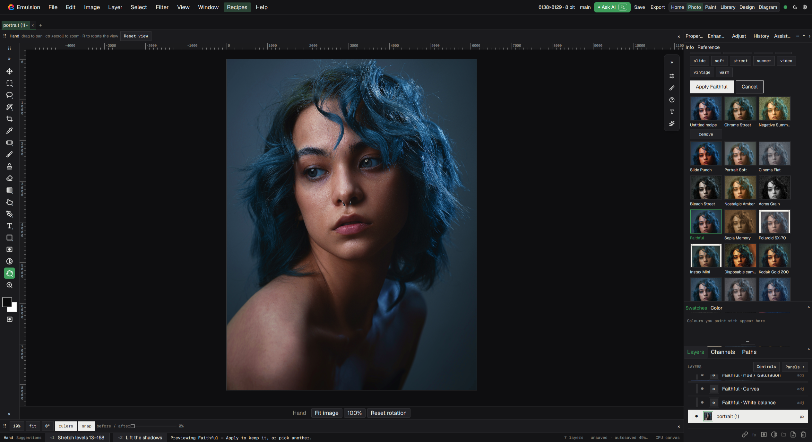
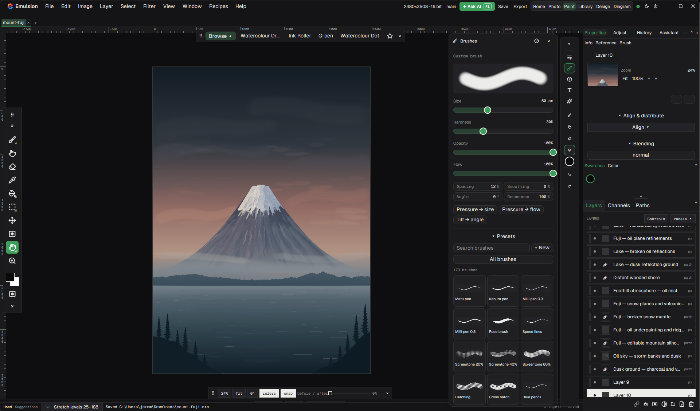
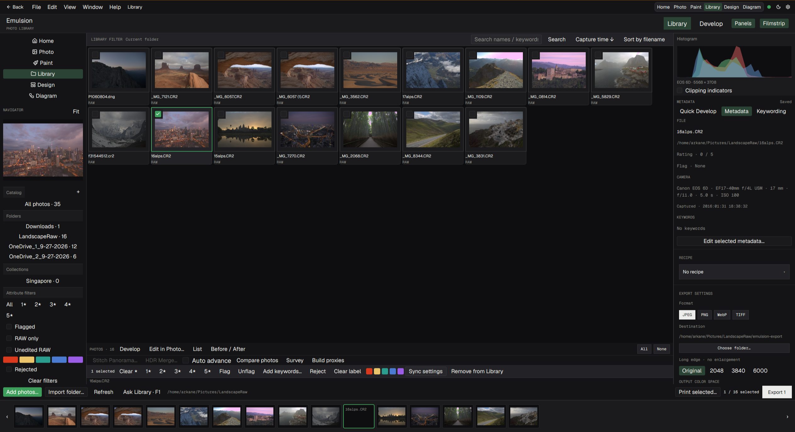
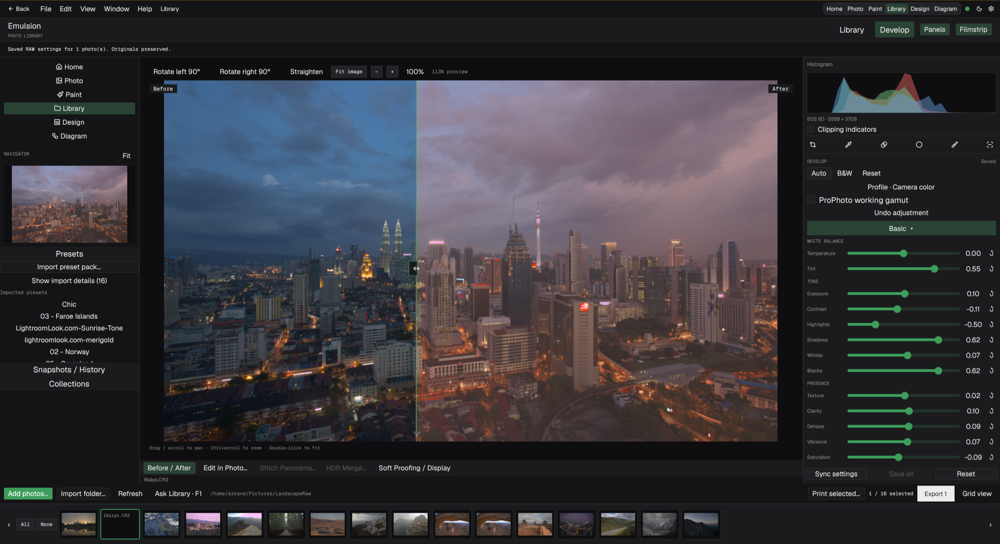
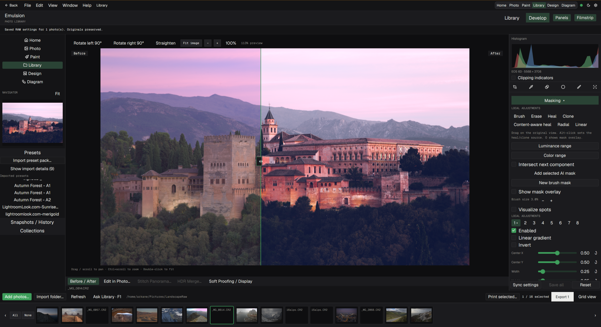
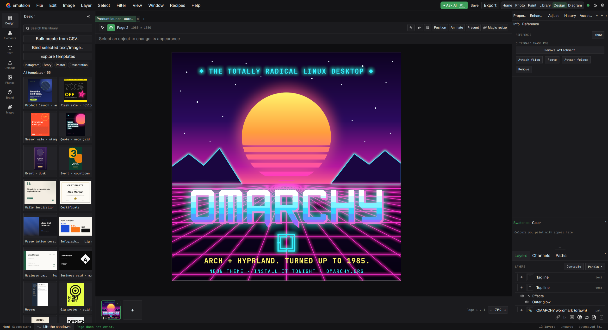
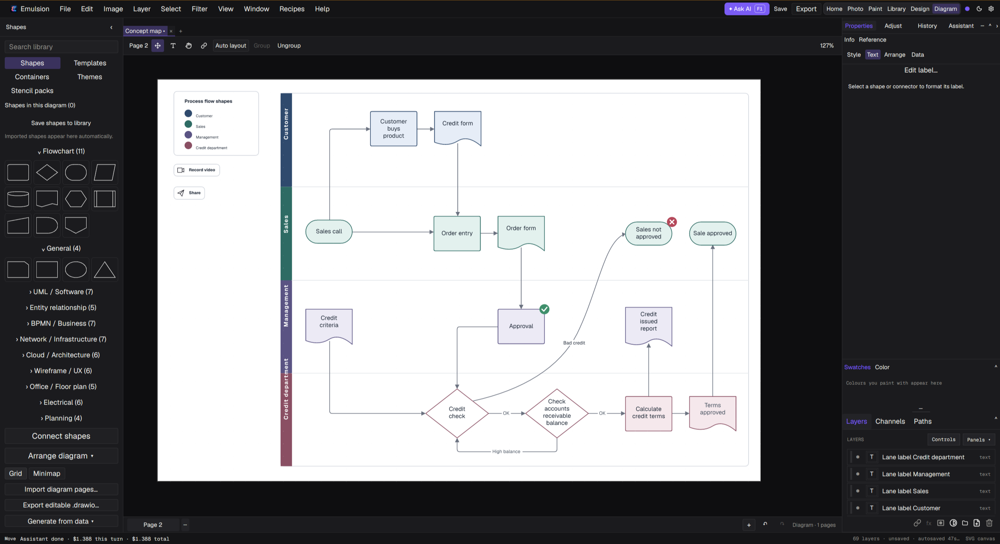
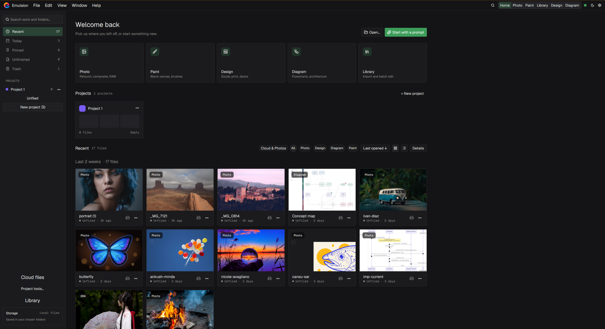
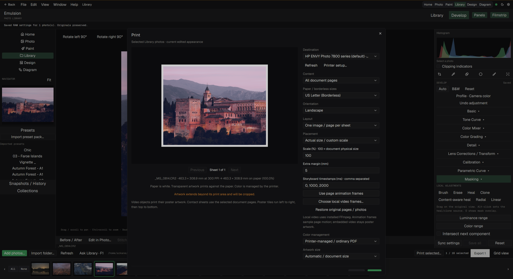

# Emulsion


**Undo any edit.**

**Website: [emulsion.pro](https://emulsion.pro)**

Emulsion is an open-source creative app for Linux, macOS, and Windows with five
workspaces: **Photo** for retouching and compositing, **Paint** for brushwork,
**Library** for organizing and developing photo collections, **Design** for
social posts, print, and presentations, and **Diagram** for flowcharts and
architecture. Move work between them without changing apps. Try a different
direction with branchable history, then return to an earlier edit when you need to.

Built in Rust with [GPUI](https://github.com/zed-industries/zed/tree/main/crates/gpui),
Emulsion brings manual editing, reusable recipes, and an integrated AI assistant
together. Connect a supported coding CLI and ask the assistant to carry out edits
using Emulsion's MCP tools, directly in your document. Everyday editing works
without an AI account or subscription.

The source for [emulsion.pro](https://emulsion.pro) lives in [`site/`](site/README.md) in this repository.
Run `cd site && npm ci && npm run dev` to work on it, or `npm run build` from
that directory to produce the static site.

## Quick install (Linux x86_64)

```sh
curl -fsSL https://emulsion.pro/install | sh
```

Downloads the latest published release, verifies its checksum, and installs
Emulsion with a desktop launcher. No Rust compiler or sudo is needed.
See [Linux installation](#install-linux) for requirements and update instructions,
or [build from source](#build) for other platforms.

## Download (Windows x64)

[Download the latest Emulsion release for Windows](https://github.com/jeremielumandong/emulsion/releases/latest/download/Emulsion-windows-x64-setup.exe)

Run the downloaded setup program. No Rust compiler or Visual Studio Build Tools
are needed to install the prebuilt release.

## Five workspaces, one app

Switch workspaces with the switcher in the top bar, or start from one of the
cards on Home. An open image moves between Photo and Paint with
Ctrl+Alt+Shift+D.

| | Library (RAW) | Photo | Paint | Design | Diagram |
| --- | --- | --- | --- | --- | --- |
| **For** | Cull and develop shoots | Retouch and composite | Draw and paint | Posts, print and decks | Flowcharts and architecture |
| **Start from** | An imported folder | An opened image | A blank canvas | 164 templates | 22 templates |
| **Core tools** | 12 Develop sections | 14 tools, 7 selection modes | 15 Paint tools | Shapes, text, charts, components | 12 shape kinds, 4 connector routings |
| **Colour and effects** | Masks (6 shapes), spot removal, grading | 18 adjustments, 25 filters, 10 layer styles | 55 built-in brushes, 9 grain kinds | Styles, variables, motion | 9 themes, 4 auto-layouts |
| **Opens** | RAW, common images, Lightroom presets | Images, PSD/PSB, XCF | Images, `.ora`, brush packs | PowerPoint, Lottie | draw.io, Visio, Lucid |
| **Exports** | Batch export with presets | PNG, JPEG, TIFF, PSD, XCF… | Images, replay GIF | PPTX, HTML, PDF, SVG, PNG | draw.io, PDF, SVG, PNG |
| **Tutorial** | [First shoot](docs/guides/tutorials/library-first-shoot.md) | [First edit](docs/guides/tutorials/photo-first-edit.md) | [First painting](docs/guides/tutorials/paint-first-painting.md) | [First project](docs/guides/tutorials/design-first-project.md) | [First diagram](docs/guides/tutorials/diagram-first-diagram.md) |

The full table, with sources for every count, is in
[Emulsion workspaces compared](docs/guides/workspaces.md).

### Photo: retouch and composite



Layer, mask, and grade photos without losing earlier choices. Photo combines
selections, adjustment layers, filters, clone, heal, liquify, editable text, and
vector paths. It opens common image formats, layered PSD/PSB and GIMP XCF files,
and other rendered images; see [Opening files](#opening-files). Camera RAW files
open in **Library Develop**. Choose **Edit in Photo…** after developing to create
a new document from the developed pixels, then save layered work as `.ora`.
The **Enhance** panel adds one-click looks and tools such as Enhance, Structure,
Glow, Sunrays, Skin, sky replacement, Relight and Expand, and each result stays
editable; see [Enhance panel](docs/guides/photo-editing.md#enhance-panel).
Guide: [Photo editing](docs/guides/photo-editing.md) ·
Tutorial: [your first photo edit](docs/guides/tutorials/photo-first-edit.md).

### Paint: blank canvas, brushes



Start from a blank canvas with a painting toolbar, a quick brush shelf, and a
palette of the colours you have already painted with. The Brush Library
organizes, imports, and exports brushes, and Brush Studio tunes them on a
drawing pad.
Keep a reference image beside the canvas, and replay the drawing from its
history as a GIF. Emulsion includes 55 built-in brushes in 10 categories.
Guides: [Paint workspace](docs/guides/paint.md) and
[Brush Library and Brush Studio](docs/guides/brush-workflow.md) ·
Tutorial: [your first painting](docs/guides/tutorials/paint-first-painting.md).

### Library: organize, develop, and export



Import photos or folders without moving the originals. Browse **Catalog**,
**Folders**, and **Collections** in the Library panel, then cull with ratings,
flags, colour labels, keywords, and smart collections. The grid and filmstrip
keep your selection in view; the right panel holds Quick Develop, metadata,
keywording, and export settings.

Open **Develop** for exposure, white balance, curves, colour grading, lens
corrections, and detail. RAW files always open here. Compare **Before / After**,
synchronize selected settings across a shoot, and export separate finished
images. Development settings save automatically to
`<original>.emulsion-raw.json` sidecars; keep them with your originals when moving
or backing up photos. Saved Develop history and named snapshots let you revisit
earlier treatments. Original photos are never overwritten.

#### Add and apply presets



1. Select a photograph and open **Develop**.
2. In the left **Presets** panel, choose **Import preset pack…**. Select a
   Lightroom `.xmp` or `.lrtemplate`, an Emulsion `.json`, or a ZIP preset pack.
3. Choose a name under **Imported presets** to apply it. Importing installs the
   presets; applying a look is a separate step.
4. Compare **Before / After**, refine the controls, and use **Sync settings** to
   copy selected adjustments to other photographs.

Use **Show import details** to review compatibility notes. Supported adjustments
are translated; proprietary Adobe/VSCO profiles and some settings are not
reproduced, so imported looks can differ from Lightroom.

#### Refine part of the photograph



Use local masks and spot removal to refine individual areas, with optional AI
subject and sky masks. Library also supports HDR merging, panorama stitching,
and Lightroom catalog import. Choose **Edit in Photo…** after settings are saved
for layered retouching, or **Print selected…** for a paper preview and printing.
See [Printing](#printing) for layouts and PDF output.

Guide: [Library and Develop](docs/guides/library-develop.md) ·
Tutorial: [your first Library shoot](docs/guides/tutorials/library-first-shoot.md).

### Design: social, print, decks



Start from 164 editable templates in 12 categories, such as posts, posters,
business cards, presentations, and responsive layouts. Build with components, saved styles,
variables, charts, tables, and CSV-generated pages. Present with a presenter
window, speaker notes, transitions, interactions, motion, and local media or
YouTube video. Open and export editable PowerPoint files, and export standalone
HTML, Lottie, PDF, SVG, and PNG. YouTube playback uses the system web runtime
and is validated on Linux.
Guide: [Design at a glance](docs/guides/design-overview.md) ·
Tutorial: [your first Design project](docs/guides/tutorials/design-first-project.md).

### Diagram: flowcharts, architecture



Connect shapes with routed connectors, containers, and UML or ER fields. Start
from 22 templates and 9 themes, and use offline shape libraries for AWS, Azure,
Google Cloud, Kubernetes, Cisco, BPMN, and more. Generate diagrams from text,
CSV, Mermaid, or SQL. Import draw.io, Visio, and Lucid files, and export draw.io,
PDF, SVG, PNG, or JPEG. Imports are editable, not pixel-for-pixel copies.
Guide: [Diagram functionality and compatibility](docs/guides/diagram-functionality.md) ·
Tutorial: [your first diagram](docs/guides/tutorials/diagram-first-diagram.md).

### How they work together

- **Library → Photo:** choose **Edit in Photo…** to take a developed photo into
  layers, selections, and retouching once Library has saved the settings. Photo
  receives developed pixels in a new document; later Library edits do not update
  it. Choose Edit in Photo again to create another version.
- **Photo ↔ Paint:** paint on a photo, or bring photo tools to a painting, in the
  same document.
- **One assistant:** the assistant and its MCP tools reach all five workspaces, so
  one request can develop, paint, lay out, or diagram.
- **Shared looks:** recipes saved in Photo apply to a whole folder in Library.
- **Portable packs:** share Design templates and Diagram stencils as
  `.emutemplate` and `.emustencil` files; see
  [portable templates and stencils](docs/guides/template-pack-format.md).



*Home, with workspace shortcuts, projects, and recent file thumbnails.*

## Why Emulsion?

- **Make room for experimentation.** Undo and redo edits, explore history branches,
  and keep adjustments, text, and paths editable in your project.
- **One app from photo to presentation.** Cull a shoot in Library, retouch the
  keeper in Photo, paint over it in Paint, lay it out in Design, and explain the
  process in Diagram.
- **Build a look, then reuse it.** Combine exposure, curves, colour adjustments,
  filters, and recipes; apply a recipe across a folder in Library.
- **Bring your existing work.** Open common image formats, camera RAW, layered
  PSD/PSB, supported GIMP XCF files, PowerPoint presentations, Lottie animations,
  and draw.io, Visio, or Lucid diagrams. See [format support](#opening-files)
  for image details.
- **Describe the work. Let the assistant do it.** The integrated assistant can
  inspect your canvas, paint, build layers, adjust colours, develop Library
  photos, and edit designs and diagrams through MCP. Review its proposed changes,
  watch approved edits appear, and keep working on the result yourself.
- **Choose your AI setup.** Connect a supported coding CLI, or use local and cloud
  image-generation providers. Generated images arrive as separate layers you can
  hide or undo.
- **Fit your desktop.** Choose light or dark mode, or follow your Omarchy theme
  on Linux. Keyboard shortcuts and adjustable tool controls keep common actions
  close at hand.
- **Open source, yours to build on.** Emulsion's original code is MIT licensed.
  Inspect it, modify it, and help shape its development.

For photographers refining a look, illustrators building a drawing, designers
preparing a deck, and anyone mapping out a system, Emulsion keeps the tools and
the edit history together.

## An assistant that works on your canvas

Ask for an outcome: “Give this photo a warmer look with editable adjustments,”
“Draw from my reference on a new layer,” “Apply this recipe to a folder of
photos,” or “Turn this process into a swimlane diagram.” The assistant can
inspect the image, choose tools, execute approved operations, and inspect the
result. Its edits appear in the same document you
work on manually, with editable layers and document history.

Emulsion includes the assistant interface and MCP integration. It connects to an
installed, authenticated **Claude Code, Codex, OpenCode, or Kimi Code** CLI; a
model or provider subscription is not bundled. Open **F1 → Assistant** to
work with the connected provider. Proposed document changes have **Apply/Skip**
controls, so you can review what the assistant is about to do.

Assistant workspaces are kept while a document is open so follow-up messages can
resume the conversation. Emulsion removes its session files after the document
closes or the next request switches providers, once the CLI has exited. Startup
also removes abandoned Emulsion session folders from earlier runs. This cleanup
does not touch the providers' personal configuration or history outside Emulsion.

### MCP tools for editing and automation

The MCP tool catalog is assembled in [`tools.rs`](crates/emulsion-mcp/src/tools.rs)
from the tool modules beside it in [`crates/emulsion-mcp/src/`](crates/emulsion-mcp/src/).
Its more than 300 tools cover:

- **Seeing the work:** document structure, rendered canvas regions, and attached
  reference images.
- **Building artwork:** layers and groups, brush strokes, erasing and smudging,
  vector paths, hatching, editable text, and liquify. See the
  [brush MCP guide](docs/guides/mcp/brush-mcp.md) for brush library tool names and examples.
- **Refining an image:** selections, masks, adjustments, blend modes, filters,
  layer styles, transforms, crop, and image/canvas sizing.
- **Managing workflows:** recipes, batch export, project saving, image export,
  history inspection, branches, undo, and redo.
- **Developing RAW:** camera/source inspection, exposure and white balance,
  auto tone, curves, sidecars/presets, camera defaults, original relinking,
  comparison previews, the live divider, and selected-photo synchronization.
  See the [RAW MCP guide](docs/guides/mcp/raw-mcp.md) for tool names and examples.
- **Running the Library:** import, views and selection, metadata, collections,
  catalog maintenance, Develop, HDR merge, panorama stitching, and export. See
  the [Library MCP table](docs/guides/library-develop.md).
- **Designing pages:** pages and templates, components, styles, charts,
  variables, brand kits, layout, interactions, motion, and project export. See
  the [MCP guides](docs/README.md#mcp-and-the-assistant).
- **Building diagrams:** shapes, connectors, stencils, templates, themes,
  comments, auto-layout, generation from text or data, and diagram import and
  export. See the [diagram MCP guide](docs/guides/mcp/mcp-diagrams.md).
- **Optional AI processing:** subject selection, background removal, inpainting,
  image generation, face restoration, and upscaling, with the required models or
  providers configured.

These are callable editing operations, not simulated clicks. The catalog defines
available arguments and requirements; it does not imply that every UI gesture
has a separate MCP tool. A client enumerates the current catalog with the MCP
`tools/list` request. Emulsion launches the server with a connection to the
active app. Running `emulsion mcp-serve` alone still answers `tools/list` but
cannot edit an open document without that connection.

## Automated checks included

Enable local formatting and lint checks before every push, once per clone:

```sh
git config --local core.hooksPath .githooks
```

The pre-push hook runs `cargo fmt --all --check` and
`cargo clippy --workspace --all-targets --locked -- -D warnings`, matching CI.
A failure blocks the push. Run `bash scripts/lint.sh` at any time to check manually.
These checks inspect the working tree; commit any fixes before pushing.

CI builds and tests the Rust project. Changes confined to `site/` skip the
Rust jobs after a lightweight change check. The separate
[website container workflow](.github/workflows/site.yml) builds and smoke-tests
the site image on website pull requests and pushes. Successful builds on `main`
publish `ghcr.io/jeremielumandong/emulsion-site:latest` and a `sha-<commit>` tag
for manual VM deployment; CI does not deploy the website.

The repository includes [GitHub Actions CI](.github/workflows/ci.yml). Pushes to
`main` and pull requests run formatting, linting, workspace tests, vendored-license
checks, and software GPU/rendering checks on Linux, plus compilation checks on
macOS and Windows. See [tool behavior coverage](docs/technical/tool-testing.md) for the
editing behaviors tested automatically.

## Contributing and security

See [CONTRIBUTING.md](CONTRIBUTING.md) for development and pull request guidance.
Report vulnerabilities privately as described in [SECURITY.md](SECURITY.md).

## Printing



Select photos in Library and choose **Print selected…**, or open a document and
choose **File → Print…**. Use **Ctrl+P** on Windows/Linux or **Cmd+P** on macOS.
Printing captures the current edited appearance, including unsaved document
changes or Library Develop settings and the selected recipe. It does not save
drafts, flatten the project, or change original photos.

Choose an installed printer, paper size, orientation, and margins. **Fit** keeps
the whole image; **Fill** crops to the available area; **Actual size** uses the
document's dimensions and resolution, with a scale control. Canvas zoom does
not change print dimensions. Print one image per sheet, arrange contact sheets
or repeating grids, or tile a poster across sheets. Review the previews and any
cropping warnings before printing.

Choose **Save PDF…** to create a file instead. Its default **Document page sizes ·
no scaling** layout preserves the selected pages' physical dimensions and
orientation. Choose a sheet layout for contact sheets or poster tiles. Further
controls include bleed, crop marks, saved layout presets, and colour management.

Native adapters are included for Linux, macOS and Windows; physical output and
platform acceptance are still being validated. Available paper and printer
options depend on the installed driver, and the preview is not a colour proof.
See [Printing](docs/guides/printing.md) for platform requirements, controls, and
current limits.

## Documentation

This README introduces each workspace and keeps the Photo editing reference.
Start with [Emulsion workspaces compared](docs/guides/workspaces.md), which
compares the five workspaces and links a guide and a tutorial for each:
[Library and Develop](docs/guides/library-develop.md),
[Photo editing](docs/guides/photo-editing.md),
[Paint](docs/guides/paint.md), [Design](docs/guides/design-overview.md) and
[Diagram](docs/guides/diagram-functionality.md).
The [documentation index](docs/README.md) groups the workspace guides under
[Photos and RAW](docs/README.md#photos-and-raw),
[Drawing and brushes](docs/README.md#drawing-and-brushes),
[Design](docs/README.md#design) and [Diagrams](docs/README.md#diagrams), and
lists every other page in three folders: user guides in `docs/guides/` (such as
[files, folders and environment](docs/guides/files-and-environment.md),
[troubleshooting](docs/guides/troubleshooting.md) and the MCP guides), technical
and contributor notes in `docs/technical/`, and plans, specifications and dated
reports in `docs/specs/`. The website ([`site/index.html`](site/index.html))
carries the illustrated getting-started guide.

## Status

Emulsion is actively developed. It includes the Photo, Paint, Library, Design,
and Diagram workspaces, recipes, RAW development, batch export, and optional
assistant and image-generation integrations. Design runtime checks on Windows
and macOS are still in progress; see
[Design platform acceptance](docs/specs/design-platform-acceptance.md).
Platform build instructions, format limits, and provider setup are documented
below.

Canvas rendering uses GPUI, while selected image-processing operations use GPU
compute with CPU fallback. Persistent GPU brush painting is experimental and
opt-in; see [GPU coverage and controls](docs/technical/gpu-rendering.md).

## Build

Linux needs the GPUI system libraries (`wayland`, `xkbcommon`, `vulkan`, `fontconfig`,
`freetype` dev packages) and a working graphics driver. Hardware is preferred;
CPU-only VMs can use Mesa Lavapipe. Windows falls back to WARP when hardware is
unavailable. See [rendering and VM support](docs/guides/rendering.md) for driver requirements
and software-renderer testing.

Building the Linux presentation video adapter also requires WebKitGTK 4.1, GTK3
and GStreamer development headers (`libwebkit2gtk-4.1-dev` and
`libgstreamer1.0-dev` on Ubuntu). Release packaging checks these dependencies;
the browser engine itself is not included in the AppImage.

Image processing uses GPU compute selectively for expensive compositing and
noise reduction, with CPU fallback. See [GPU coverage and controls](docs/technical/gpu-rendering.md).

```sh
cargo run -p emulsion-app                 # open the editor shell
cargo run -p emulsion-app -- mcp-serve    # stdio MCP server for editing tools
cargo test --workspace -- --test-threads=1
```

See [tool behavior coverage](docs/technical/tool-testing.md) for the unit and headless UI
tests, expected results, and checks that still require real hardware.

GPUI's exact dependency versions are vendored under `vendor/gpui/` and selected
through Cargo path patches. See [maintaining GPUI](vendor/gpui/README.md).

Emulsion's original code is [MIT licensed](LICENSE). Vendored code retains its
upstream licenses; GPUI is primarily Apache-2.0. See
[third-party notices](THIRD_PARTY_NOTICES.md) for attribution and scope.

## Install (Linux)

Install the latest published Linux x86_64 release:

```sh
curl -fsSL https://emulsion.pro/install | sh
```

The installer downloads from this repository’s GitHub Releases, checks the
SHA-256 checksum, and installs the AppImage and desktop launcher for your user.
No Rust compiler or sudo is needed. A working graphics driver and the AppImage’s
system libraries are still required. Rerun the command to update; quit Emulsion
first. To select a release, use `curl -fsSL https://emulsion.pro/install | EMULSION_VERSION=v0.0.1 sh`.
The endpoint requires the updated website deployment and a published release
containing the installer bundle; see [release packaging](docs/technical/releases.md).

YouTube playback inside Design presentations additionally uses the system
WebKitGTK 4.1 and GStreamer codecs. On Arch install `webkit2gtk-4.1`,
`gst-plugins-good` and `gst-libav`; on Ubuntu use `libwebkit2gtk-4.1-0`,
`gstreamer1.0-plugins-good` and `gstreamer1.0-libav`. These are optional for
editing documents. See [Design video](docs/guides/design-video.md) for platform runtimes
and playback limitations.

To build and install from a source checkout instead:

```sh
scripts/install-appimage.sh --build   # build the AppImage and install it
scripts/install-appimage.sh --uninstall
```

This puts `Emulsion.AppImage` in `~/Applications`, an `emulsion` command in `~/.local/bin`, and a
desktop entry with icons and file associations. Your settings, recent files and API
keys in the data directory are kept; only its `sessions/` folder (per-run assistant
configs, regenerated on demand) is cleared.
`scripts/build-appimage.sh` only builds, into `target/appimage/`.

Flatpak:

```sh
scripts/build-flatpak.sh        # build and install for the current user
scripts/build-flatpak.sh --run  # also launch it afterwards
```

This needs `flatpak` and `flatpak-builder`; the GNOME 50 runtime and SDK
(`org.gnome.Platform//50`, `org.gnome.Sdk//50`) and the freedesktop 25.08
`rust-stable` SDK extension are installed from Flathub on first run. The build
fetches crates over the network; when `flatpak-cargo-generator` is installed the
script also writes `packaging/flatpak/cargo-sources.json` from `Cargo.lock` for an
offline build, which the shipped manifest does not yet use. The Flatpak sandbox
cannot see host converters; see [Opening files](#opening-files).
The GNOME runtime supplies GTK3, WebKitGTK 4.1 and GStreamer, so video and
YouTube playback use the shared runtime rather than a WebKit installed on the
host; see [Design video](docs/guides/design-video.md).

## Build (Windows)

To install the prebuilt app, [download the Windows x64 installer](https://github.com/jeremielumandong/emulsion/releases/latest/download/Emulsion-windows-x64-setup.exe).
The instructions below are for building from source.

Install Rust and Visual Studio Build Tools with the **Desktop development with C++**
workload (including the Windows SDK). Use the MSVC Rust toolchain; the repository's
`rust-toolchain.toml` selects the Rust version.

```powershell
.\scripts\build-windows.ps1                       # release build
.\scripts\build-windows.ps1 -Configuration Debug  # development build
.\scripts\build-windows.ps1 -Package              # release build + NSIS installer
```

The script works from any working directory and builds the `emulsion` executable
under `target/` (normally `target/release/emulsion.exe` or `target/debug/emulsion.exe`).
Cargo errors stop the script. Release builds launch without a console window;
debug builds retain the console for diagnostics.

For packaging, install `cargo-packager` with
`cargo install cargo-packager --version 0.11.8 --locked`. `-Package`
uses cargo-packager's NSIS backend (downloaded automatically on first use) and
creates `target/windows/emulsion_<version>_x64-setup.exe` on x64 Windows.
The installer installs for the current user, supplies shortcuts and an
uninstaller, and bundles runtime DLLs beside the application. The app and
installer use the Emulsion icon. These local builds are unsigned.

Close a running copy from `target/release/` before rebuilding, since Windows
locks executable files while they are in use. Coding assistant detection supports
native Windows executables and npm launchers, including Claude Code in
`%USERPROFILE%\.local\bin` and Codex in `%APPDATA%\npm`.

The experimental wgpu/Vello canvas is enabled by default. Set
`$env:EMULSION_GPU_CANVAS = '0'` before launching to compare the CPU canvas. See
[GPU canvas](docs/technical/gpu-rendering.md#gpu-canvas)
for launch commands and checks.

## Build (macOS)

```sh
scripts/build-macos.sh             # build and package for this Mac
scripts/build-macos.sh --no-build  # package an existing release binary
```

Requires Rust and the standard macOS `iconutil` and `sips` tools for the icon.
The script creates a versioned `.app` and `.dmg` in `target/macos/`. The app is
signed ad hoc for local use. Release builds are signed with Developer ID and
notarized by the **macOS signed release package** workflow for Apple silicon
(Intel Macs are not supported); see [docs/technical/releases.md](docs/technical/releases.md#signed-macos-disk-images).

## Appearance

The interface uses compact chrome: there is no separate client title bar and the
top bars are tight, leaving more height for the canvas; the window moves through
the desktop (Super-drag on Omarchy) and Ctrl-Q quits. The assistant panel under
the canvas folds to one line with its ▾ chip.

Open the theme button (a sun or moon icon) in the top bar and choose **Light** or
**Dark** for Emulsion's built-in palette. On Linux, **Follow Omarchy** in the same
menu takes the colours of the active Omarchy theme and follows changes while
Emulsion is running (within about a second); while it is on, the menu item and the
button's tooltip show the theme's name. Choosing Light or Dark, or
**View › Light or Dark Interface**, switches back to Emulsion's own palette. On an Omarchy
desktop a first run starts in the theme's colours; an existing settings file is
left as it is. macOS and Windows keep the built-in theme controls. The package also
ships a symbolic icon (`emulsion-symbolic`) that themed panels and launchers can
recolour.

Emulsion reads `omarchy/current/theme/colors.toml` under `$XDG_STATE_HOME`
(default `~/.local/state`), with a fallback to `$XDG_CONFIG_HOME` (default
`~/.config`) for older installations. No hooks or system configuration changes
are needed. If no valid palette is available, the saved built-in mode is used;
a failed live reload retains the last valid palette until another valid one appears.
The canvas surround and transparency checkerboard keep Emulsion's neutral colors
for the selected light/dark mode; theme colors never alter document pixels.

## Compact project files

Saving an ORA stores each unique editable path once, shared by the current
artwork and its history. Coordinates remain full precision; redundant corner
handles are omitted and reconstructed exactly. Layer previews and history are
kept, with lossless ZIP compression.

Older projects open normally. Newly saved projects use native format version 2
and need this updated Emulsion build for native editing; other OpenRaster
readers can still use the included layer previews.

To create and verify a separate compact copy:

```sh
cargo run --release -p emulsion-io --example compact_native -- input.ora compact-copy.ora
```

## Opening files

Emulsion decodes these itself: its own `.ora`, Photoshop `.psd`/`.psb`, GIMP `.xcf`
(8-bit layers with names, offsets and opacity), PNG, JPEG, WebP, TIFF, BMP, GIF, SVG
and `.svgz`, JPEG XL, Targa, PNM/PAM, Windows icons, Radiance HDR, OpenEXR, DDS,
QOI, farbfeld, and camera RAW from Sony, Canon, Nikon, Adobe DNG, Fujifilm, Olympus,
Panasonic, Pentax and more through rawler. Camera/model/compression support varies;
see the [tested RAW samples](crates/emulsion-io/tests/fixtures/RAW-CORPUS.md).
Nikon HE/HE★ sensor decoding is [experimental](docs/guides/nikon-he.md); its color and
tone reconstruction are approximate, and the RAW panel displays a warning.
The document raster uses 16-bit linear RGB; floating-point and RAW sources are
converted to that representation, not retained as floating-point document pixels.

CMYK images are converted to RGB for editing. CMYK JPEGs use the decoder's
approximate conversion; 8-bit and 16-bit CMYK TIFFs use an embedded CMYK ICC
profile when supported, with an approximate conversion otherwise. CMYK color
entry is available through **CMYK…** in the foreground color popup and in the
layer-effect color picker. Cyan, magenta, yellow, and black accept percentages
from 0 to 100; these controls use an approximate conversion, without a printer
profile. Native projects and exports retain RGB pixels, not CMYK ink separations.

CMYK Photoshop PSD/PSB files open their saved merged appearance as one editable
RGB layer. This supports 8-bit files with four CMYK channels and raw or RLE
compression, using an embedded CMYK profile when supported. Extra alpha/spot
channels, ZIP compression, and higher-bit-depth CMYK PSD files are not supported.

### Developing RAW photos

Opening a RAW file enters Library Develop. Develop there, then choose
**Edit in Photo…** once the settings are saved to open the developed pixels in a
new Photo tab for layers and retouching. Later Library edits do not update that
Photo document; choose Edit in Photo again to create a new version. See
[Library and Develop](docs/guides/library-develop.md#raw-development-and-photo-editing)
and the [first Library shoot tutorial](docs/guides/tutorials/library-first-shoot.md).

Library provides tone curves, colour grading, local masks, spot removal, lens
profiles, sensor denoise, highlight reconstruction, HDR merge and panorama
stitching. Development settings save automatically to fingerprint-bound
`<original>.emulsion-raw.json` sidecars, with saved Develop history and snapshots.
Keep the originals and sidecars together; the original RAW is never modified.
Camera support varies by camera and file.

#### Legacy Photo projects with embedded RAW recipes

The Photo RAW controls and save/export behavior below apply to older projects
that carry an embedded RAW recipe. They are separate from the current Library
workflow. **RAW original → Develop in Library…** creates an independent Library
virtual copy, including unsaved development settings, without changing existing
Photo layers or the original's sidecar. Editing that copy does not update the
Photo document.

RAW files are developed from sensor data, not their embedded JPEG. The RAW panel
offers exposure, temperature, tint, shadow lift, black clipping, brightness,
contrast, saturation, and highlight rolloff, applied in
floating-point before conversion to the document's bounded linear-sRGB raster.
Development includes black/white levels, Bayer or X-Trans demosaicing, camera
color conversion, and orientation/crop metadata. Embedded previews speed up
thumbnail loading where available.

The **Adjust** section includes **Auto tone**, a sensor-based **Pick neutral**
white-balance tool, an independent **As-shot WB** reset, and display-only clipping
and tone comparisons. **Curve** adds Linear/Medium/Strong presets and five
editable luminance points. **Settings** saves and loads Emulsion JSON sidecars
and presets, copies selected parameter groups, manages explicit per-camera
defaults, and synchronizes selected open RAW photos. These settings are not
Adobe XMP. See [RAW development controls and limits](docs/guides/raw-development.md)
for controls and current limits.

Choose **Before / after** in RAW Properties to reveal a draggable divider over
the photo: as-shot development on the left, your edited image on the right.
Drag the handle horizontally, or use Left/Right and Home/End while the canvas
is focused. Escape closes comparison. Comparison does not change saved edits;
starting another edit closes it.

In the legacy Photo RAW workflow, **Save / Ctrl+S** writes development settings
beside the original as `<filename>.emulsion-raw.json` (for example,
`DSC_1234.NEF.emulsion-raw.json`). Reopening the original automatically restores
those settings; the original RAW is never modified. Keep the sidecar with the
photo when moving or backing it up; if you rename the photo, rename the sidecar
to match. This is Emulsion JSON, not Adobe XMP.
An invalid or mismatched sidecar produces an error rather than silently losing
your saved edits. Sidecars store the current RAW recipe, not undo history.

**Save as** creates an `.ora` project. Save also asks for a project when the
document has layers, other non-RAW edits, or named versions that a sidecar cannot
preserve. Save as `.ora` to retain versioned RAW settings, undo history, a rendered preview,
and a SHA-256-verified link to the original. Keep the original file: it is not
embedded in the project. **Locate original…** reconnects a moved, identical file.
A project can reopen without its original, but changing RAW settings or exporting
the linked RAW layer requires it. Painting directly on that layer detaches the RAW
recipe; use another layer for nondestructive retouching.

Export redevelops the linked source at full resolution. PNG, JPEG, WebP, and TIFF
offer sRGB or Adobe RGB output with matching profiles and full/half/quarter sizes;
PNG/JPEG/TIFF can also store print-resolution metadata without changing pixel
dimensions. PNG/TIFF support 16-bit output. Changing export profile does not
recover colors already clipped in the sRGB working document. Save/export waits for RAW editing
to finish (retry when the preview is ready). Original RAW paths are protected
against native-save and export overwrites, including after relinking or painting.

Current limits: monitor-profile conversion and wide-gamut floating-point
documents are not part of this path. Lens profiles, sensor denoise and
highlight reconstruction are in Library Develop, not in the Photo RAW panel.
Photo's **Filter** menu also has a lens profile filter for pixel layers.
Cancellation discards obsolete results but cannot
interrupt individual decoder stages. A 128-megapixel shared decoded-source budget
and serialized heavy stages limit concurrency, not every upstream allocation.

### Other formats through installed converters

Other formats go through a converter already on the machine when one is
installed: HEIC/HEIF (`heif-convert` from libheif), AVIF (`avifdec` from libavif),
PDF and PostScript first pages (`pdftoppm` from poppler), and everything ImageMagick
reads (PCX, Paint Shop Pro, XPM/XBM, SGI, Sun raster, FITS, DICOM, JPEG 2000, ICNS,
GIMP brushes and patterns). Unknown extensions are tried the same way. Without a
converter the error names what to install. The Flatpak sandbox cannot see host
converters, so this path applies to the AppImage and native builds.

```sh
cargo run --release -p emulsion-io --example open_any -- picture.heic layered.xcf
```

### Exporting

Export writes PNG, JPEG, WebP and TIFF (8 or 16-bit), layered PSD and layered
8-bit XCF, and behind **more formats…**: OpenEXR and Radiance HDR (float), BMP,
GIF, Targa, PPM, ICO, QOI and farbfeld, plus AVIF, HEIC, JPEG XL and one-page PDF
when `avifenc`, `heif-enc`, `cjxl` or ImageMagick is installed. Formats without
transparency composite over white. XCF carries the visible top-level layers with
their names and opacity, each rendered with its own adjustments, masks and styles
baked in; hidden layers are left out.

## Editor controls

The right dock keeps **Layers** visible, with its own scrolling list and
**+ Layer**, **Group**, **Duplicate**, and **Delete** actions. **+ Layer** starts
with **Empty layer (transparent)**, also on Ctrl-Shift-N; the rest of the menu
adds adjustments, a solid fill, a LUT or a group. Choosing **Transparent** under
Background in **New document** (Ctrl-N) starts a document with one empty layer
instead of a white background. Below the layer list:

- **Properties** edits the selected layer, including transforms, blending, and masks.
  To deselect, press Escape with the panel focused, Ctrl-click the selected row,
  or click empty space under the list; the next stroke then starts a new layer.
- **Adjustments** adds adjustment layers and filters, then opens their Properties.
- **Reference** keeps an attached image beside the canvas while selecting layers.

Choose **Grade** in the left toolbar for colour and tone work. Its top bar adds
Exposure, Curves, Color Balance, or Hue/Saturation as editable adjustment layers;
**All adjustments** opens the full catalogue. Selecting Grade with an adjustment
layer selected opens its existing controls in Properties.

The **Panels** menu opens Navigator, Info, Recipes, Timeline, History, or Histogram
in the same dock. Active tool options stay above the canvas.
Recipes shows one collection at a time: **Emulsion** holds the starter set, the
camera presets and everything you save; the other chips open the shipped
community library, grouped by film simulation family (Classic Chrome, Classic
Negative, Provia, Velvia, Astia, Pro Neg, Eterna, Black and white). Each library
recipe keeps its creator and source in its notes; tags narrow a collection by
look, colour or black and white, and sensor generation.
Leaving Recipes cancels an unapplied preview; leaving Timeline stops playback
and returns to the full document. Timeline also holds **Replay drawing**: the
picture played back from its history (every step still undoable and every save),
over the canvas, with a GIF export. Nothing is recorded ahead of time.

Tool buttons and options support Tab navigation and Enter/Space activation.
Focused sliders accept arrow keys, Shift+arrow for larger steps, and Home/End
for their limits. Down opens a tool group's flyout; Escape dismisses it.
Selecting a tool returns keyboard focus to the canvas.

With Zoom selected, hold Shift (or Alt) to zoom out; the magnifier indicator
changes immediately. Hold Shift while drawing a shape for a square or circle.
Escape cancels an active tool gesture. Delete/Backspace removes the last point
of an unfinished polygon or magnetic selection instead of deleting the layer.

Default shortcuts: tool letters (V M L W C I J B S E G P T U H R Z),
Shift+letter to step through a tool group, D/X colours, Q Quick Mask, [ ] brush
size, Shift+[ ] hardness, 1–0 opacity, Shift+Alt+letter blend modes, Ctrl+L/M/U/B/I
adjustments, Ctrl+J/G/E, Ctrl+Shift+E merge visible, Ctrl+Alt+G clipping mask,
Alt+[ ] layer selection, Ctrl+Shift+D reselect, Ctrl+Alt+F last filter,
Ctrl+Shift+X Liquify, Ctrl+K preferences, F toggles full screen, Tab hides the
panels, and F5/F7/F8 open Brush Settings, Layers and Info. Also:
F1 (or Alt+F1) asks the assistant, Ctrl+F searches layers, Shift-Q grade, Alt-L magnetic lasso, and
Ctrl+Alt+Shift+D switches between Photo and Paint. Settings lists every binding. Bare keys
apply while the canvas has focus; text fields retain normal typing behavior.

## Library batch export

Library catalogs, culls, and develops photo folders; see
[Library and Develop](docs/guides/library-develop.md) for its views, Develop
panels, collections, and import options. For batch export with a recipe,
choose a folder in the top bar, then select photos in the left pane. The centre
shows the current photo; the right dock groups **Recipe** and **Export settings**.
Open the recipe chooser to search by name or tag, and expand **Category** when
you need a filter. Choosing a recipe closes the list. Set the format and output
folder in the dock, then use **Export** in the top bar.

Use **Fit image** and the **− / +** controls above the preview to navigate.
Drag or scroll to pan, Ctrl/Alt/Cmd+scroll or pinch to zoom, and double-click
to fit again. Selecting another photo resets the view; changing its recipe
keeps your view. Zoom inspects the rendered preview (up to 1100 pixels),
not the full-resolution export.

## Image generation

Press **F1** and choose **Assistant**, **Local SD**, **OpenAI**, or **Google**.
Assistant keeps the editing and drawing workflow. The image providers create
a new raster layer; with an active selection they fill that area using the
surrounding canvas as context. Enter your prompt and press **Enter**. Generated
layers are labelled with their model and can be hidden or undone.

Configure providers under **Settings → Image generation**:

- **Local SD:** start A1111 / Forge with `./webui.sh --api`; use
  `http://127.0.0.1:7860` as the base address.
- **OpenAI:** save an API key, or set `OPENAI_API_KEY`. The default model is
  `gpt-image-2.5-sunburst`.
- **Google:** save a Gemini API key, or set `GEMINI_API_KEY` (`GOOGLE_API_KEY`
  is also accepted). The default model is `gemini-3.1-flash-image`.

Each provider keeps its own model and credentials. Environment keys take
precedence over saved keys. **Save & test** checks key/model access without
generating an image; it does not verify generation quota. If Google reports
`free_tier` with `limit: 0`, check billing, prepaid credits, and model quotas
for the API key's project in Google AI Studio. Waiting for a retry timer will
not increase a zero quota. Cloud generation sends prompts and fill context to the chosen
provider and uses separately billed API access, not a chat/CLI subscription.
Google fill follows mask instructions; Emulsion masks the result locally so
pixels outside the selection stay untouched. Cancelling discards the result;
it does not guarantee cancellation of the provider's processing or charges.

The Select tool's **generate** field uses the default provider from Settings.
Attached Reference images are used by **Assistant**; image modes currently
use the prompt and selected canvas context.

Provider documentation: [OpenAI Images](https://developers.openai.com/api/docs/guides/image-generation),
[Gemini Images](https://ai.google.dev/gemini-api/docs/generate-content/image-generation).

## Drawing from a reference

Choose **Attach files** in the editor's Reference panel, or **Add reference** in
the Ask bar, then select an image. **Paste** attaches an image from the
clipboard, and **Attach folder** attaches a folder. Its preview stays beside the canvas for manual drawing and painting.
Ask Emulsion to use it, for example: “Draw this character in manga style; keep
the pose and expression.” The assistant can inspect the attached image directly.
Use **Remove** or **hide/show** in the panel to manage it; attaching another
image replaces the current one.

References belong to the current open document session; reattach them after
reopening. They are separate from artwork and are not included in exports.

To render the manga guide's example locally, without an assistant provider:

```sh
cargo run --release -p emulsion-assistant --example playbook -- --guide manga --out target/manga-studies
```

This writes a PNG and an editable ORA for inspection.

## Cropping

The Crop tool's **delete cropped pixels** option is on by default: applying a crop cuts every unrotated pixel layer and its mask down to
the new canvas in the same undo step. Turn it off to keep layers whole beyond
the edge, where the Move tool can bring them back. Rotated, scaled and smart
layers are never cut, and Canvas Size always keeps every pixel.

## Image size and canvas size

Click the dimensions beside the document name (for example **1920×1080 · 8 bit**)
to open the size panel, with **image size** (scale the picture, constrain
proportions, pixels or percent) and **canvas size** (grow or trim, anchored,
relative amounts, fill new edges). Ctrl-Alt-I and Ctrl-Alt-C open each directly,
and the Crop tool's options carry a **size…** chip.

## Rotating objects

Select a layer and use **Rotate object** in **Properties**. Enter an angle and
choose **Apply**, or use the 90° buttons. Positive angles turn clockwise.
Paths and text stay editable; groups rotate together around their content.
Each rotation can be undone. Locked layers must be unlocked first.

## Layout

| Path | What lives there |
|---|---|
| `crates/emulsion-app` | The `emulsion` binary |
| `crates/emulsion-ui` | GPUI views and design tokens |
| `crates/emulsion-core` | Document model, Command API, history graph |
| `crates/emulsion-raster`, `-gpu`, `-filters`, `-color` | Pixels, compositing, adjustments, color |
| `crates/emulsion-tools` | Reserved tool crate; current tools live in `emulsion-ui` and `emulsion-raster` |
| `crates/emulsion-io` | File formats |
| `crates/emulsion-recipes` | Recipes, film recipes and the shipped community library (`library/`, regenerated by `scripts/gen-recipe-library.js`) |
| `crates/emulsion-ai`, `-mcp`, `-assistant` | Optional AI: local models, MCP server, coding-CLI bridge |
| `spikes/` | Phase 0 experiments and measured results |
| `docs/` | User guides (`guides/`), technical notes and the ADR template (`technical/`), plans, specs and dated reports (`specs/`); see the [documentation index](docs/README.md) |

## License

Emulsion's original code is available under the [MIT License](LICENSE).
Vendored libraries keep their own licenses and attribution requirements;
see [third-party notices](THIRD_PARTY_NOTICES.md) and the
[GPUI vendoring notes](vendor/gpui/README.md).
