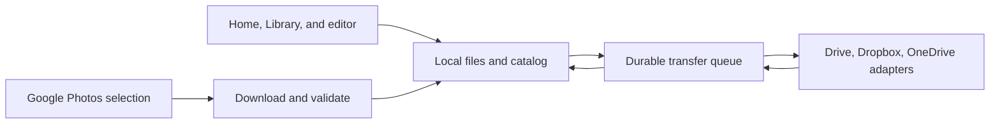

# Cloud project sync and photo sources

*Feasibility and implementation proposal, 2026-09-27. This is planned behavior,
not an implemented feature. Current file behavior is documented in the
[product guide](../README.md). Provider documentation was checked on this date;
authenticated API experiments have not been run.*

Emulsion can support Google Drive, Dropbox, and OneDrive for project and image
storage. Start with Google Drive. Integrate Google Photos as an explicit photo
import source, with export of finished photos considered later. Keep editing
local and upload completed saves in the background.

## Provider feasibility

| Provider | Project sync | Images and photo library | Recommended starting scope |
| --- | --- | --- | --- |
| Google Drive | `.emu`, `.ora`, source files, and sidecars | Emulsion-managed images; explicitly selected existing files | `drive.file`, with a visible Emulsion folder |
| Google Photos | No native project storage | User-selected photo imports; later, uploads of finished photos | Picker API; separate consent for later Library API features |
| Dropbox | Same project and source file model as Drive | Images inside the app folder initially; broader import later | App Folder access |
| OneDrive | Same project and source file model through Microsoft Graph | Images inside the app folder initially; broader import later | Delegated `Files.ReadWrite.AppFolder` |

Google Drive's `drive.file` permission covers files created by the app or
explicitly opened/shared with it. It does **not** mean Emulsion can recursively
browse every existing image in a selected folder. Start with app-managed files;
prototype an explicit Google Picker flow for existing files before promising
whole-folder imports. Broader Drive access introduces restricted-scope review
requirements. [Drive scopes](https://developers.google.com/workspace/drive/api/guides/api-specific-auth)

Dropbox distinguishes App Folder from Full Dropbox access. The first is enough
for project sync but not browsing an existing Pictures folder elsewhere in the
account. [Dropbox OAuth and content access](https://docs.dropboxapi.com/dropbox-api/docs/oauth)

Microsoft documents app-folder access for both personal and work/school
OneDrive. Validate the exact endpoint/permission combination for each account
type; corporate consent restrictions remain an adoption consideration.
[OneDrive app folders](https://learn.microsoft.com/en-us/graph/onedrive-sharepoint-appfolder)

### Google Photos changes the library experience

Since the 2025 API changes, the Library API manages app-created content. For
existing photos, the user opens Google's Picker, selects items, and returns to
Emulsion. A continuously synchronized view of the user's entire existing
Google Photos library is not a supported design using these APIs.
[Google Photos API changes](https://developers.google.com/photos/support/updates)

Implement **Import from Google Photos** in Library and the photo-opening flow.
Create a Picker session, open its selection URL in the system browser, poll at
the prescribed interval, list the selected items, then download supported
images into managed local storage. Preserve source attribution and selection
identity, and deduplicate downloaded bytes. Imported items then participate in
Emulsion's local collections, ratings, and editing workflow.
[Picker workflow](https://developers.google.com/photos/picker/guides/get-started-picker)

Picker media URLs expire, normally after 60 minutes. They must never become
permanent library paths. Finish downloading while access is valid; refresh
access within a valid session or ask the user to select again if necessary.
The documented image download option omits location metadata, so do not
promise an archival, byte-identical camera-original import. Test supported
formats, dimensions, orientation, profiles, and metadata explicitly.
[Media retrieval](https://developers.google.com/photos/picker/guides/media-items)

Google's policy permits editing workflows but prohibits recreating a general
purpose Google Photos gallery. Keep this integration centered on selecting
photos for creative work. Any subsequent transfer to a project-sync provider
must be a disclosed, consented feature. Treat retention, deletion controls,
and encryption at rest as implementation requirements, including downloaded
media and derived previews, not only OAuth tokens.
[Photos data policy](https://developers.google.com/photos/support/api-policy)

The Ambient API is designed for displaying photos on ambient devices; it is
not the basis for this editor integration.
[Ambient API](https://developers.google.com/photos/ambient)

## What the repository already provides

| Existing code | Consequence for integration |
| --- | --- |
| [`emulsion-io/src/project.rs`](../crates/emulsion-io/src/project.rs) | `.emu` atomically saves a package of complete page ORAs, including page histories. Sync the complete saved package initially. |
| [`emulsion-io/src/ora.rs`](../crates/emulsion-io/src/ora.rs) | Single-document `.ora` retains editable state and history. Include it alongside `.emu`. |
| [`emulsion-io/src/creative_library.rs`](../crates/emulsion-io/src/creative_library.rs) | Catalog records use local paths and incrementing IDs; they need stable cross-device identities. |
| [`emulsion-ui/src/home_projects.rs`](../crates/emulsion-ui/src/home_projects.rs) | Home folders organize references. Removing/trashing a Home reference does not delete its source. Preserve that behavior. |
| [`emulsion-ui/src/batch/library.rs`](../crates/emulsion-ui/src/batch/library.rs) | Library currently requires local files. Download remote assets before passing them into the existing editing pipeline. |
| [`emulsion-core/src/raw.rs`](../crates/emulsion-core/src/raw.rs) | RAW documents retain a source path and SHA-256 fingerprint. Syncing the edit alone does not transfer the camera original. |
| [`emulsion-ui/src/workspace.rs`](../crates/emulsion-ui/src/workspace.rs) | Successful background saves provide the integration point for queueing a cloud revision. |

The catalog currently caps assets at 10,000 and projects at 20,000. The `.emu`
reader/writer enforces a 2 GiB decoded archive budget. These are existing
application limits, independent of provider storage limits. Whole-account
photo indexing would also require a separate catalog scalability project.

## Proposed architecture

Add an `emulsion-cloud` crate for account management, provider adapters,
transfers, and reconciliation. Keep network operations out of the document
model and rendering path. Existing HTTP infrastructure uses `ureq`; evaluate
reuse on background workers before adding another runtime or client.

Use two capabilities: file storage for Drive/Dropbox/OneDrive, and selected
media import for Google Photos. Do not force Photos into a filesystem API.
File adapters expose listing, stable IDs, download, resumable upload, change
tracking, and supported conditional-update semantics. Represent unsupported
capabilities explicitly.

Introduce a versioned sync index, preferably SQLite for transactional queue
updates, with:

- Stable Emulsion UUIDs for projects, assets, collections, and folders.
- Provider, account, remote item ID, remote revision, local content hash, and
  last synchronized revision for each binding.
- Local materialization paths stored per device, separately from portable
  metadata and remote identities.
- Persistent jobs, retry state, upload session progress, change cursors,
  conflict records, and deletion markers.
- Source provenance and consent state for imported Photos media.

Migrate existing catalog entries by assigning UUIDs and retaining local IDs
and paths for compatibility. Back up the catalog before migration. Do not
upload the current `catalog.json` wholesale: local paths, counters, and its
revision number do not provide multi-device identity or conflict resolution.

Initially synchronize project discovery metadata and selected assets. Add
collection membership, ratings, tags, and folder organization later using
per-record revisions. Preserve simultaneous metadata changes for resolution;
do not select a winner solely from device wall-clock timestamps.

### Save and sync contract

1. Finish the local atomic save. Report **Saved locally** independently of
   cloud availability.
2. Queue an immutable snapshot of that saved generation, identified by UUID
   and content hash. Uploading from the live path risks reading a later save.
3. Coalesce pending superseded saves, while keeping in-flight snapshots stable.
   Explicit saves and a debounced checkpoint policy control upload frequency.
4. Upload all required dependencies, then publish a manifest referencing the
   complete revision. An incomplete upload must not become the discoverable
   current project.
5. Reconcile incoming revisions before replacing local files. An open dirty
   editor is never replaced by a background download.

Use whole-package transfer first. A small edit may require uploading a large
archive; resumable upload avoids restarting a failed transfer but does not
provide delta compression. Measure realistic large documents before deciding
whether to introduce content-addressed chunks or a new storage format.

Treat binary projects as indivisible revisions. If two devices save from the
same base, preserve both and present **Keep this version**, **Use other
version**, and **Keep both** with previews and device/time information.
Existing document history is not a distributed merge protocol.

Use provider revision checks only where verified for the relevant upload
commit operation. A metadata check followed by unconditional overwrite has a
race. The safe baseline is uniquely identified immutable revision files and
parent-revision manifests: concurrent children remain discoverable conflicts.
A mutable “latest” index may accelerate discovery but cannot be the sole
source of truth. Verify behavior after an ambiguous upload response before
retrying, and deduplicate by operation/revision identity.

Preserve source files on local library removal. For the initial release,
remote deletion marks an item unavailable and retains downloaded copies and
unsynced edits. Add deliberate cloud deletion and version pruning only with
clear controls. Sync is not a guarantee of indefinite backup retention.

### RAW portability and cache ownership

Track RAW originals as immutable dependencies, keyed by their fingerprints,
alongside native projects or RAW sidecars. Resolve each dependency to a local
path on the receiving device and verify its hash before redevelopment. Include
dependencies used by retained history/pages, not just the visible page.

Offer **Include original for editing on other devices**. Without it, clearly
identify the missing original and the resulting redevelopment limitation.
Do not describe such a project as fully portable. Audit other external
dependencies, particularly fonts, separately; embedding rights and substitute
font rendering need explicit treatment.

Separate disposable thumbnails and redownloadable files from durable imported
media and unsynchronized snapshots. Never evict the only copy of an imported
Photos image, dirty project, or required original. Bound downloads and disk
usage, allow cancellation, validate file contents, and keep partial downloads
outside the paths used by the editor. Avoid running a provider desktop sync
client and Emulsion's direct sync engine over the same managed cache.

## Authentication and provider details

Use system-browser authorization-code flows with PKCE and state validation,
provider-supported native redirects, and refresh tokens where needed. Store
credentials in the operating system credential store; handle an unavailable
Linux secret service with session-only authentication or an explicitly
unlocked encrypted store. Never put tokens into project files, logs, or the
synchronized catalog. Public desktop applications cannot protect an embedded
client secret. [Google native OAuth](https://developers.google.com/identity/protocols/oauth2/native-app),
[Dropbox OAuth](https://docs.dropboxapi.com/dropbox-api/docs/oauth),
[Microsoft OAuth](https://learn.microsoft.com/en-us/entra/identity-platform/v2-oauth2-auth-code-flow)

| Provider | Transfer and change tracking | Prototype must prove |
| --- | --- | --- |
| Drive | Resumable uploads and persisted Changes page tokens | App-created content is discoverable on a second installation; narrow-scope behavior; collision-safe revision publication |
| Dropbox | Upload sessions and `list_folder` cursors; long polling where useful | Revision-based conflict handling, interrupted upload recovery, and app-folder discovery |
| OneDrive | Upload sessions and delta tracking where the selected scope supports it | App-folder permissions for each endpoint/account type, commit-time preconditions, and fallback scoped enumeration |
| Photos | Picker sessions, paginated selected items, temporary media URLs | Browser return/cancellation, expiration recovery, metadata behavior, and supported image decoding |

These mechanisms are documented in the [Drive upload guide](https://developers.google.com/workspace/drive/api/guides/manage-uploads),
[Drive Changes guide](https://developers.google.com/workspace/drive/api/guides/manage-changes),
[Dropbox file guide](https://docs.dropboxapi.com/dropbox-api/docs/file-access),
[OneDrive upload sessions](https://learn.microsoft.com/en-us/graph/api/driveitem-createuploadsession?view=graph-rest-1.0),
and [OneDrive delta API](https://learn.microsoft.com/en-us/graph/api/driveitem-delta?view=graph-rest-1.0).
Endpoint support must be tested rather than inferred from the common adapter.

Poll while Emulsion runs, and reconcile on startup/resume. Back off on rate
limits and honor retry instructions. No always-on backend is required for
the proposed desktop sync architecture. Sync while Emulsion is closed would
require a separate background service. A hosted browser bridge may be useful
for the Drive web Picker; prototype this separately from native OAuth.

Register provider applications and configure production consent, redirect
URIs, privacy/help pages, and applicable verification before release. Recheck
quotas against the actual app registrations. Photos Picker and Library have
different quota systems; do not size imports using the Library quota.
[Photos quotas](https://developers.google.com/photos/overview/api-limits-quotas)

## Product behavior

- **Home → Cloud files → Manage connections:** connect and disconnect accounts
  and import app registrations. Connecting Drive does not automatically connect
  Google Photos. Storage-use reporting remains follow-on work.
- **Home → Cloud files:** search and filter one card per file, browse 48 files
  per page, and download/open other-device files. Open version history for one
  file at a time. Local cards expose sync actions and status; their context menus
  include project moves, classification, pause/resume, and cloud history.
- **Library → Add source:** local files, Photos selection, and authorized
  provider files. Display source badges and download status; search the local
  catalog and expose remote search only when supported.
- **Save status:** Saved locally, Waiting for connection, Uploading, Synced,
  Needs sign-in, Storage full, or Conflict. Failed cloud uploads never imply
  the local save failed.
- **Offline:** downloaded projects remain editable and changes queue until
  reconnection. Remote-only items clearly require a download.
- **Disconnect:** stop jobs and remove credentials; retain local creative work
  and offer separate controls for cached account data. Provide a documented
  deletion path for imported provider data.

Start with one sync destination per project. Supporting several connected
providers is useful; mirroring one mutable project across all of them is a
separate reconciliation problem. Real-time collaboration, organization-wide
shared-drive indexing, automatic photo replacement in Google Photos, and
whole-library Photos mirroring are outside the initial scope.

## Delivery sequence and acceptance gates

| Stage | Deliverable | Exit condition | Rough engineering effort |
| --- | --- | --- | --- |
| 0 | Provider/auth and portability experiments | Two-device Drive discovery; resumable transfer; concurrent-save preservation; Photos import; RAW dependency round trip | 1–2 weeks |
| 1 | Shared infrastructure and Drive beta | Durable queue, stable identities, offline saves, cloud discovery, conflict UI, and source dependency handling | 4–6 weeks |
| 2 | Google Photos import | Selection, durable local import, provenance, duplicate handling, expiration/cancellation recovery, and data controls | 1–2 weeks |
| 3 | Dropbox adapter | Same file-sync contract and failure tests, App Folder first | 1–2 weeks |
| 4 | OneDrive adapter | Personal and work/school behavior validated, with permissions and consent failures surfaced | 2–3 weeks |
| 5 | Broader library sync and optimization | Collection/metadata reconciliation, scoped image browsing, measured transfer/caching improvements | Estimate after beta measurements |

These are planning estimates for one engineer familiar with the repository,
not delivery commitments. Stages 0–2 suggest roughly **6–10 engineering weeks**
for the first useful Drive-plus-Photos release. All four providers suggest
**9–15 weeks**, excluding broader library sync, external approval delays, and
any major portability or security work uncovered by the experiments.

Before public beta, test two devices editing offline from the same base;
crashes before/after remote commit; ambiguous responses and duplicate jobs;
expired/revoked tokens; account switching; quota/storage exhaustion; source
renames/deletions; missing RAW originals; disk-full recovery; suspended/resumed
machines; and incompatible/newer project formats. Downloaded bytes must pass
existing archive validation before activation. Exercise large realistic
projects and verify that network work does not stall drawing or saving.

The first implementation decision should follow Stage 0: proceed with Drive
and Photos only if narrow-scope discovery, safe concurrent publication, native
sign-in, and portable RAW editing are demonstrated. The existing code makes
this direction plausible, but these experiments are still outstanding.
